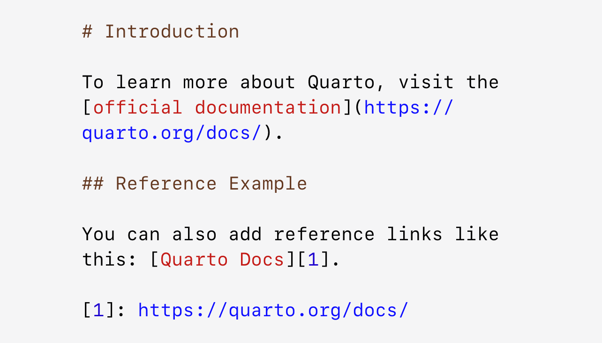

# Contributing to the Analyst's Guide

Thank you for investing your time in contributing to the analyst's guide! All contributions are very welcome - we want this to be a useful resource for the whole analytical community in DfE :sparkles:.

Read our [Code of Conduct](./CODE_OF_CONDUCT.md) to keep our community approachable and respectable.

The main branch of the site is protected and can only be updated via pull requests. All pull requests must be approved by a repository admin before merging.

In this guide you will get an overview of the contribution workflow from opening an issue, creating a PR, reviewing, and merging the PR.

## New contributor guide

To get an overview of the project, read the [README](README.md). Here are some resources to help you get started with open source contributions:

-   [Finding ways to contribute to open source on GitHub](https://docs.github.com/en/get-started/exploring-projects-on-github/finding-ways-to-contribute-to-open-source-on-github)
-   [Set up Git](https://docs.github.com/en/get-started/quickstart/set-up-git)
-   [GitHub flow](https://docs.github.com/en/get-started/quickstart/github-flow)
-   [Collaborating with pull requests](https://docs.github.com/en/github/collaborating-with-pull-requests)

### Quarto guidance

For more information specific to how a quarto site works, and for examples of what is possible within a static quarto site, see the main [Quarto website](https://quarto.org/).

#### Visual Editor

The Visual editor in RStudio provides a WYSIWYM interface for authoring Quarto documents. Under the hood, prose in Quarto documents (.qmd files) is written in Markdown, a lightweight set of conventions for formatting plain text files. In fact, Quarto uses Pandoc markdown (a slightly extended version of Markdown that Quarto understands), including tables, citations, cross-references, footnotes, divs/spans, definition lists, attributes, raw HTML/TeX, and more as well as support for executing code cells and viewing their output inline. While Markdown is designed to be easy to read and write, it still requires learning new syntax.
Therefore, if you’re new to computational documents like .qmd files but have experience using tools like Google Docs or MS Word, the easiest way to get started with Quarto in RStudio is the visual editor.

In the visual editor you can either use the buttons on the menu bar to insert images, tables, cross-references, etc. or you can use the catch-all ⌘ + / or Ctrl + / shortcut to insert just about anything. If you are at the beginning of a line, you can also enter just / to invoke the shortcut.

#### Adding images (in the right folder, code to do so)

Inserting images and customizing how they are displayed is also facilitated with the visual editor. You can either paste an image from your clipboard directly into the visual editor (and RStudio will place a copy of that image in the project directory and link to it) or you can use the visual editor’s Insert > Figure / Image menu to browse to the image you want to insert or paste it’s URL. In addition, using the same menu you can resize the image as well as add a caption, alternative text, and a link.

The visual editor has many more features that we haven’t enumerated here that you might find useful as you gain experience authoring with it.

Most importantly, while the visual editor displays your content with formatting, under the hood, it saves your content in plain Markdown and you can switch back and forth between the visual and source editors to view and edit your content using either tool.

#### Adding links (within page, within site, external to site)\]

In Quarto, adding links is straightforward using Markdown.

In Markdown, you can add links using the following syntax:

 1. Inline Links:
    [Link Text] ``(https://example.com)``

 2. Reference Links:
    [Link Text][1]

   `` [1]: https://example.com``
    
In Quarto, you can also include links within various contexts, such as code blocks or embedded within other content structures, depending on the complexity of your document. However, the basic Markdown link syntax will generally cover most use cases.
 
 {width=100}{height=100}
 
 #### Adding videos / other content
 
 In Quarto, you can add various types of content, including videos, to your documents. Here's how you can include videos and other content in a Quarto document when working with R Markdown.

##### **Adding Videos**
You can embed videos in Quarto documents using HTML, Markdown, or specialised Quarto syntax. Here are some methods:

1. Using the  shortcode.
  - For example, here we embed a YouTube video:

 

2. Embedding videos in other formats:
  - In HTML formats the video will be embedded within the document.
  - For other formats, a simple link to the video will be rendered.

##### **Adding Other Content**
 - **Audio Files**:
 You can embed audio files using the HTML <audio> tag.
 - **Interactive Content with HTML Widgets**:
 Quarto supports various HTML widgets that can add interactive content to your document. 

##### Tips 
- **Relative Paths**:
Use relative paths for local files to ensure your document remains portable. 

- **Test Across Browsers**: Ensure multimedia content works across different browsers and devices. 

- **Output Formats**: Verify that multimedia elements render correctly in the intended output formats (HTML, PDF, etc.). 

By following these methods, you can effectively add videos, images, audio, and interactive content to your Quarto documents, enhancing their informativeness and engagement.


#### Redirecting pages where changing / removing


#### Checking for broken links when changing headings


#### Building locally before raising a pull request


#### Changing the appearance of code blocks

You can modify the `highlight-style` element in the `quarto.yml` file to change the display of code blocks using predefined themes. This will change the appearance of all code snippets across the entire Analysts' guide. The current theme is set to "printing" but there is a list of other available themes [on the Quarto website](https://quarto.org/docs/output-formats/html-code.html#highlighting).

Some things to be aware of before you make changes:

-   Some of the themes are adaptive, meaning that if you change the site view from dark mode to light mode then the theme will also change accordingly.

-   The appearance of code snippets will only change if the language (e.g. R, Python) is defined at the start of the snippet (e.g. ```` ``` {r connection_example, eval=FALSE} ````). Including `eval=FALSE` stops your code snippet from actually running. If no language is defined, the snippet appearance will need to be modified manually and this can cause some issues.

### Adding images from draw.io

You can create images, flowcharts, and diagrams using [draw.io](http://draw.io). To add them to the Analysts' guide, we recommend embedding them, by selecting File > Embed > HTML. The image below shows the options that you should select when embedding a diagram


### Issues

#### Create a new issue

If you spot a problem with the site, [search if an issue already exists](https://docs.github.com/en/github/searching-for-information-on-github/searching-on-github/searching-issues-and-pull-requests#search-by-the-title-body-or-comments). If a related issue doesn't exist, you can open a new issue using a relevant [issue form](https://github.com/dfe-analytical-services/analysts-guide/issues/new/choose).

#### Solve an issue

Scan through our [existing issues](https://github.com/dfe-analytical-services/analysts-guide/issues) to find one that interests you. If you find an issue to work on, you are welcome to open a PR with a fix.

### Make Changes

Key things to remember when making or proposing changes:

-   Where guidance already exists elsewhere it should be linked to rather than duplicated

-   When adding images, save them in the /images folder

-   When adding files for download, save them in the /resources folder - Don't commit rendered .html files for pages

-   If your changes remove or edit a pre-existing anchor link, consider how that will be redirected for users who may have bookmarked it

#### Make changes in the UI

Click **Edit this page** at the bottom of the right hand table of contents of any page to make small changes such as a typo, sentence fix, or a broken link. This takes you to the `.Qmd` file where you can make your changes and [create a pull request](#pull-request) for a review.

#### Make changes locally

1.  Clone or fork the repository.

2.  Open the repository in your editor of choice, e.g. R Studio.

3.  Create a working branch and start with your changes!

4.  Commit and push the changes to your working branch.

### Pull Request 

All pull requests should be made against the main branch.

When you're finished with the changes, create a pull request, also known as a PR.

-   Don't forget to [link PR to issue](https://docs.github.com/en/issues/tracking-your-work-with-issues/linking-a-pull-request-to-an-issue) if you are solving one.

Once you submit your PR, a repository admin will review your proposal. We may ask questions or request additional information.

-   We may ask for changes to be made before a PR can be merged, either using [suggested changes](https://docs.github.com/en/github/collaborating-with-issues-and-pull-requests/incorporating-feedback-in-your-pull-request) or pull request comments. You can apply suggested changes directly through the UI. You can make any other changes and then commit them to your branch.

-   As you update your PR and apply changes, mark each conversation as [resolved](https://docs.github.com/en/github/collaborating-with-issues-and-pull-requests/commenting-on-a-pull-request#resolving-conversations).

-   If you run into any merge issues, checkout this [Git tutorial](https://github.com/skills/resolve-merge-conflicts) to help you resolve merge conflicts and other issues.

## Support

If you need any assistance at all, please contact [statistics.development\@education.gov.uk](mailto:statistics.development@education.gov.uk).
